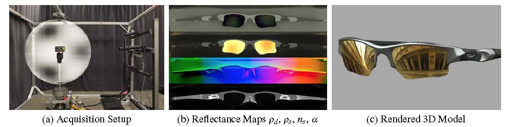
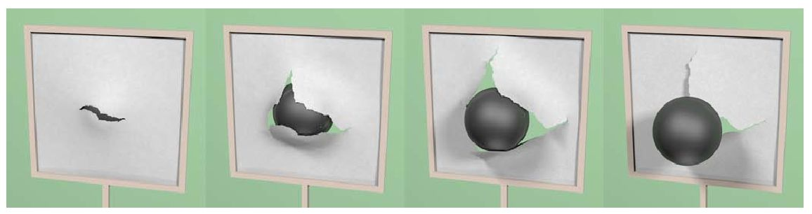

SIGGRAPH Image Wall
===================

> Let's try to make a image wall for SIGGRAPH (2013) technical papers!

Motivation
----------
[SIGGRAPH][1] is really great, and those published technical papers keeps pushing it to the un-explored limit.
It is easy to get a list of great work through [official website][1].
However, if you don't like to wait til the last minute,
you can visit [Ken-Sen Huang's collection (ex, for SIG'13)][4] frequently and get surprised.
You can get something really refresh there, and study papers prior to attending the conference.

[This year][2], there is a compilation of the 1st page of all technical papers,
[Technical Papers First Pages][3].
I think it would be great to have a image wall, a pinterest-like website,
which dedicates to provide ease-to-read, inspiring and a ToC-like functionality.

I need your help.

Goal
----

* An image wall of technical papers in nearly all SIGGRAPH or other related conferences.
* As easy as possible to browse for human beings and to parse for machine programs.
* No license issues or copyright conflict/fight for using.
* Coop with other great ideas or similar services to help inspiring research in
  computer graphics and computer vision fields.
* Be friendly.

Task
----
* First and the most important one, to figure out the suitable license for this work.
  I don't like to get into trouble like [this][5] or make issues to people providing help.
  Right now, I use [CC0, Public Domain Dedication][6].
* Secondly, I need your help :)
* To compile a human-friendly and machine-readable format of papers.
  I think [BibJSON][7] should be a great choice.
* To build a pinterest-like website for human browsing and machine parsing.
* To design a website, not just a pinterest-like one,
  but in consideration of researchers.
  Of course, it should be as elegant as possible.

Example: Teaser Images
----------------------
  
3d_shape_regression_for_real-time_facial_animation.jpg  
  
a4_asynchronous_adaptive_anti-aliasing_using_shared_memory.jpg  
  
acquiring_reflectance_and_shape_from_continuous_spherical_harmonic_illumination.jpg  
  
adaptive_fracture_simulation_of_multi-layered_thin_plates.jpg  
  
adaptive_image_synthesis_for_compressive_displays.jpg  
  

For more teaser images, check *teaser_images/* folder.

References
----------
* [SIGGRAPH 2013 Technical Papers][2]
* [SIGGRAPH 2013 Technical Papers First Pages (44 MB PDF)][3]
* [SIGGRAPH 2013 papers on the web][4]
* [Official SIGGRAPH][1]
* [ACM copyright policy and Ke-Sen Huang's pages][5]

[1]: http://www.siggraph.org/ "ACM SIGGRAPH"
[2]: http://s2013.siggraph.org/attendees/technical-papers "SIGGRAPH 2013 Technical Papers"
[3]: http://s2013.siggraph.org/sites/default/files/firstpages-lores.pdf "SIGGRAPH 2013 Technical Papers First Pages (44 MB PDF)"
[4]: http://kesen.realtimerendering.com/sig2013.html "SIGGRAPH 2013 papers on the web"
[5]: https://groups.google.com/d/topic/ray-tracing-news/ndaSHwvfTEE/discussion "ACM copyright policy and Ke-Sen Huang's pages"
[6]: http://creativecommons.org/publicdomain/zero/1.0/ "CC0 1.0 Universal (CC0 1.0) Public Domain Dedication"
[7]: http://www.bibjson.org/ "BibJSON"
